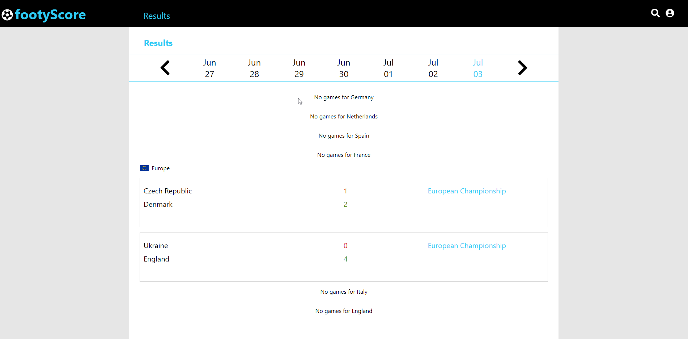
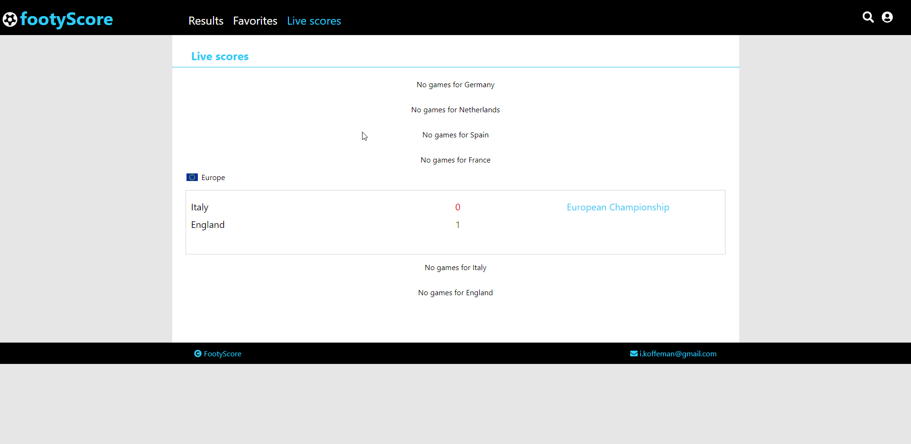

#FootyScore app

#Inhoudsopgave
- [1. Inleiding](#1-inleiding)
- [2. API Key](#2-api-key)
- [3. De applicatie starten](#3-de-applicatie-starten)
- [4. Resultaten en live scores ophalen](#4-resultaten-en-live-scores-ophalen)
- [5. Beveiligde content bekijken](#5-beveiligde-content-bekijken)
- [6. Tests](#6-tests)
 
# 1. Inleiding

Deze applicatie is ontwikkeld voor de frontend module van de bootcamp FullStack Developer. De applicatie biedt gebruikers de kans om uitslagen van de meest bekende voetbalcompetities op te vragen. Geregistteerde gebruikers hebben ook de mogelijkheid om live scores van wedstrijden te zien. Dit document beschrijft hoe je het project werkend kunt krijgen.

# 2. API Key

De API calls moeten worden voorzien van een API key.

API key: `ddabb8b4425f4870ac199dc2b69b8b57`

De API key dient ingevuld te worden in app.js (in de src folder) en Competition.js (in de components folder)

`const apikey = 'ddabb8b4425f4870ac199dc2b69b8b57';`

# 3. De applicatie starten

Nadat je het project gecloned hebt van github naar jouw local machine, is het nodig eerst de node_modules te installeren door het volgende commando in de terminal te runnen:

`npm install`

Wanneer dit afgerond is, kun je de applicatie starten door het volgende commando in de terminal te typen:

`npm start`

Wanneer je WebStorm gebruikt kun je ook de knop (npm start) gebruiken.

# 4. Resultaten en live scores ophalen

Vanwege het feit dat deze applicatie uitslagen en live scores van wedstrijden ophaald. Wil ik even toelichten dat live scores alleen beschikbaar zijn wanneer er wedstrijden aan de gang zijn op het moment dat je de applicatie bekijkt en test. Daarom verwacht ik dat de pagina live scores momenteel vaker niet dan wel scores zal tonen. Het is voor de voetballers tenslotte ook vakantietijd. Het is altijd even op te zoeken of er op de dag zelf wedstrijden gespeeld worden in Engeland, Duitsland, Spanje, Nederland, Italië of Frankrijk. 

Betreft de 'results' pagina kun je bijvoorbeeld kijken op:

- 13 juni
- 29 juni
- 3 juli 

Er worden dan zeker wedstrijden opghaald voor de gespeelde wedstrijden van het Europees kampioenschap.
Je kunt ook een van de andere dagen dat er wedstrijden gespeeld zijn voor het Europees kampioenschap of opzoeken wanneer er het afgelopen jaar wedstrijden waren in 1 van de bovengenoemde competities op het hoogste niveau. (Premier league, Bundesliga, Primera Division, Eredivisie, Serie A of Ligue 1)

Uiteraard is de live score functionaliteit wel getest tijdens het Europees kampioenschap en werkt dit. 

# 5. Beveiligde content bekijken
Bepaalde menu links en content is alleen beschikbaar wanneer je ingelogd bent (o.a. My profile, live scores, searc en favorites). De applicatie maakt gebruik van een backend (NOVI backend) waarbij de database gegevens na 30 minuten inactiviteit weer geleegd wordt. Daarom zijn er geen logingegevens bijgeleverd. Het is nodig om eerst een account aan te maken alvorens de inlogfunctionaliteit gebruikt kan worden. Dit kan via de signup pagina. Welke via de account menu button te bereiken is. 

De backend draait op een 'gratis' Heroku server. Deze server wordt automatisch inactief wanneer er een tijdje geen requests gemaakt worden. De eerste request die de server weer uit de 'slaapstand' haalt zal daarom maximaal 30 sec. op zich laten wachten. Hierna is de responsetijd normaal. Als gebruiker zul je dit momenteel alleen merken doordat het laden na het eerste requests iets langer in beeld blijven staan. 

Kortom: Maak eerst een account aan voordat je kunt inloggen. 

# 6. Tests 

Er zijn een aantal tests geschreven voor de helperfuncties. De tests staan in helpers.test.js (src folder). Je kunt deze runnen door het volgende commando in de terminal in te typen:

`npm run test`

Het kan zijn dat je vervolgens het volgende terug krijgt:

`No tests found related to files changed since last commit.`

Kies dan voor `a` om alle testen te runnen